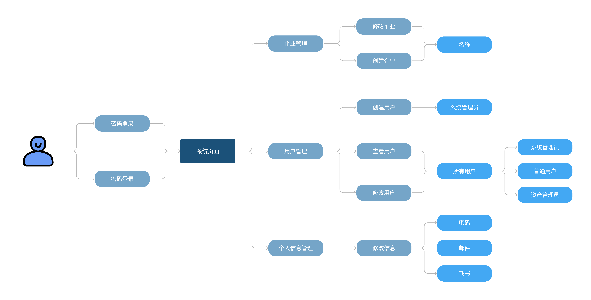
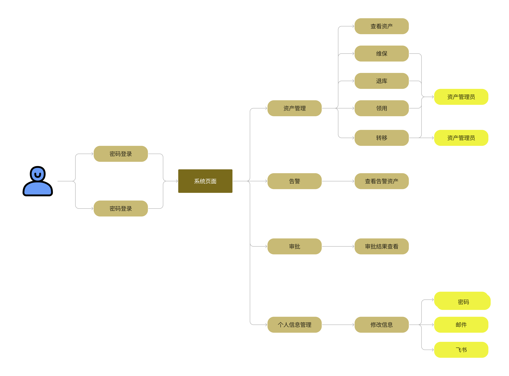
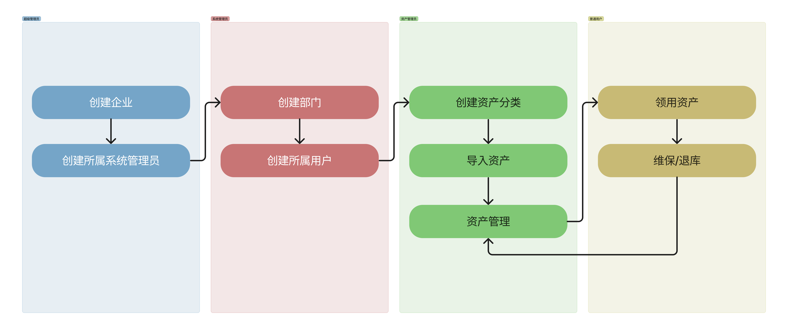

# 项目概述

### **项目参与人员**
- **Luca1K (刘亦谦)**
- 永恒丿至灬尊 (肖霖昕)
- 烟雨行舟～ (刘晟男)
- ^O^ (徐沛阳)
- calvin (张凯文)

### **项目背景**

**启源资产管理系统**致力于对资产的全生命周期进行监控，从资产的预算计划、采购入库，到资产的移动、调拨、退库，整个过程受到系统的监控，包括使用单位、人员和出现的变动、维修记录等。系统会通过严格规范的管理流程提高资产利用率，避免资源浪费。通过条码技术，赋予每件资产实物唯一条码资产标签，针对资产实物进行全程跟踪管理，提高资产盘点的效率，解决以往企业资产盘点不规范、工作量大、实物不符、闲置浪费和资产流失的问题。为企业的资产管理工作提供全方位可靠的动态数据与决策依据，实现资产管理工作的信息化与规范化管理，提升企业的管理水平，提高了资产管理的工作效率，使资产管理更加轻松便捷，是企业开展资产管理项目的不二之选。同时，项目系统兼典雅与科技感为一，配具翔实的引导与提示，化繁为简易于上手，秉持高效、高雅、高质量的开发管理规范，让用户在系统使用过程中获得不一样的技术体验。

### **项目目标**

本项目主要目标为实现精简的企业资产管理系统，实现基本的资产入库、资产领用、资产借用、资产转移、资产清退、资产维修、资产卡片查看和资产标签打
印等，同时支持基本的审批流程并能够进行可视化呈现。

项目实现多企业共同管理，企业之间采取权限隔离，不同角色各司其职，建立起典型企业的层级树架构，高层系统管理员能够管辖所属范围的全部人员，检查系统操作日志等，并将资产管理权限交由其下部门资产管理员，协同用户开展围绕资产的相关活动。

    

    权限功能
    
有关用户权限的详细功能，请移步<strong>用户权限</strong>一节

### **需求分析**

#### **用户诉求**

    

    系统管理员
    
作为一名系统管理员，我的职责是维护企业员工数据，对于资产进行的操作交由各部门执行即可，我只需在日志中查看监控即可。但我身为大公司主管，所辖用户数以万计，每日系统操作日志更是不计其数，需要平台能够支持高效的管理与搜索功能。

    

    

    资产管理员
    
对于资产的操作多而复杂，有时寻找某个功能都极其困难，枯燥的选项栏令人眼花缭乱，需要美观且清晰的功能分类。一些批量任务的执行也不应当长时间等待，应当创建异步任务队列交由上层管理员进行管辖。

    

    普通用户
    
在公司员工的角度，企业的资产管理平台应当以简单实用为主，对于众多功能应当具有导航指引功能，对于自己的资产能够搜索查看，方便使用。

#### **用户用例图**

 
超级管理员：

系统管理员：

资产管理员：

普通用户：

#### **泳道图流程展示**

### **需求清单**
|  需求编号 |      需求名称      |    需求说明    |     交付时间    |
| -------  |  --------------- | ------------- | ------------- |
|  FT:01   |    登录登出   |  用户可以登录系统，可以登出系统 |  Sprint 2   | 
|  FT:02   |    用户管理   |  系统管理员可以创建维护系统的用户，重置用户密码，锁定解锁用户，设置用户角色  | Sprint 2   |
|  FT:03   |    角色权限   |  系统管理员可以创建维护系统的角色 |  Sprint 2   |
|  FT:04   |    组织数据管理 | 系统管理员查看和维护企业的组织部门数据。组织可以是多级。组织用于员工的归属和资产的挂账部门 |   Sprint 2   |
|  FT:05   |    员工数据管理  |  系统管理员查看和维护企业的员工数据。员工用于资产的挂账人 |  Sprint 2   |
|  FT:06   |    应用门户   |  员工登录系统后，显示不同应用的门户入口。例如显示资产管理入口，进入后界面菜单为资产管理应用的菜单 | Sprint 2   |
|  FT:07   |    应用管理   |  系统管理员可以管理应用。应支持将第三方 URL 配置为一个菜单项。不同菜单项对应不同的功能权限 |  Sprint 3   |
|  FT:08   |    待办任务   |  员工需要处理的代办任务的入口，主要是审批单。例如主管所收到的资产领用的审批单 | Sprint 3   |
|  FT:09   |    操作日志  |  系统管理员可以查看系统操作日志，包括登录日志、关键数据修改日志 |  Sprint 3   |
|  FT:10   |    导入导出管理  |  批量导入或导出时需要创建异步任务。系统管理员可以查看和管理异步任务，包括下载失败记录文件，重新执行任务，下载任务结果文件等 | Sprint 4   |
|  FT:11   |    飞书账号绑定   |  系统已有用户支持绑定飞书账号，并支持通过飞书的方式登录 |  Sprint 4   |
|  FT:12   |    飞书消息推送   |  将站内的消息提醒自动推送到账号所绑定的飞书账户中，包括员工的 申请成功提交提醒、申请状态修改提醒，资产管理员的新申请提醒等等。(网页端的审批情况推送到飞书，包括新审批，审批结果通知) |  Sprint 4  |
|  FT:13   |    飞书审批管理   |  资产管理员可以利用飞书的审批功能来审批资产相关的申请而无需进 入网页端操作。调用飞书审批 API，使用飞书审批系统进行资产审批 |  Sprint 4   |
|  FT:14   |    飞书人事管理   | 支持向系统同步飞书中的所有用户并在系统中自动创建。支持自动同步飞书新增员工 | Sprint 4   |
|  FT:15   |    业务实体定义   |  系统的超级管理员创建和管理该应用的业务实体列表。业务实体表示共用同一个系统但互相隔离的不同组织如租户。业务实体可以是一个顶级部门，或一个子公司。业务实体之间的资产是隔离的，不能互相使用。系统的超级管理员可以为每个业务实体委派系统管理员 | Sprint 3   |
|  FT:16   |    资产分类定义   | 资产管理员定义资产的层级分类树。具体的资产将必须挂靠在某个层级分类下。该层级分类为资产的自然分类，即品类。支持每种品类定义是条目型资产还是数量型资产 |   Sprint 2   |
|  *FT:17*   |    资产属性定义   |  **资产管理员定义某业务实体下资产的自定义属性，用于业务定制场景。例如某制造公司的资产需要指定用于哪个生产线** |  未交付   |
|  FT:18   |    资产标签定义   |  资产管理员定义打印出来的资产标签卡片内容的模板。打印出来的资产标签用于粘贴在资产设备上 |  Sprint 4   |
|  FT:19   |    资产录入   |  资产管理员可以一次录入多个资产，包括条目型资产和数量型资产。多个资产之间存在主从关系，例如计算机主机和显示器、耳机。新录入的资产先挂账在某个资产管理员下。(2') 资产录入的有关信息支持 富文本格式编辑。(1') **资产录入的有关信息支持上传图片，且图片通 过 OSS 的方式存储。(1')** |  Sprint 4   |
|  FT:20   |    资产信息变更   |  资产管理员可以修改单个资产实例的信息，包括基本资料、位置、价值、数量等。资产管理员可以变更资产之间的主从关系。例如将某计算机的显示器配件关联到另一台计算机 ｜  Sprint 4   |
|  FT:21   |    资产查询   | 资产管理员根据常用条件如名称、描述、分类等查询自己管辖的资产。资产管理员根据资产**自定义属性查询资产**。资产管理员可以查看单个资产的全视图，包括资产资料、使用情况、维保历史、转移历史、借用历史等。资产管理员可以打印单个资产实例的标签，用于粘贴在资产设备上 | Sprint 4   |
|  FT:22   |    资产批量导入   | 资产管理员可以通过文件批量导入资产。场景一:部门新采购了一批资产，需要快速导入到资产管理应用系统;场景二:以前手工 EXCEL 管理的资产，需要导入到新的资产管理应用系统 |  Sprint 3   |
|  FT:23   |    资产清退  |  资产管理员对已经服役期满或损坏报废的资产进行清退处理。一次可以清退多个资产。清退的资产价值为零，不能再参与使用 |  Sprint 4   |
|  FT:24   |    资产调拨   | 资产管理员向其他部门的资产管理员批量调拨资产 |  Sprint 4   |
|  FT:25   |    资产历史   | 资产管理员或专员根据常用条件查询资产的变更历史，包括维保、转移、借用等 |  Sprint 4  |
|  FT:26   |    资产查看   | 员工查看自己名下挂账了哪些资产。(1') 对于资产的描述图片启用晚 加载机制。(1') |   Sprint 4   |
|  FT:27   |   资产领用   |  员工向资产管理员领用资产。一次可以领用多个资产。员工先提交领用申请，经过资产管理员审批后，资产会挂账到当前员工名下 |  Sprint 4   |
|  FT:28   |    资产退库   |  员工的资产不再使用时，可以提交资产退库申请。当前部门的资产管理员收到申请后进行确认处理，资产就移交回资产管理员名下，待再次被领用 |   Sprint 1   |
|  FT:29   |    资产维保   |  员工提交资产维修保养申请，维保责任人接到申请后将资产拿去维护处理。完成维护之后再交回给当前使用人 | Sprint 4   |
|  FT:30   |    资产转移  |  员工将某些资产转移给另一个员工。资产转移提交申请后，经过主管审批通过后，资产的挂账人和部门切换为新的员工和部门。资产的位置也跟着迁移到新位置 |  Sprint 4   |
|  FT:31   |    资产扫描   | 可以支持扫描粘贴在资产设备上的标签读取资产的有关信息。如果是 跳转式，请自行设计具有移动端适配功能的展示网页。如果完成了 OA 对接相关功能，可以实现为读取资产 ID 后自动唤起飞书，在飞书 中显示有关资产信息 |  Sprint 4   |
|  FT:32  |   资产统计  | 资产管理员可以查看自己管辖内的资产的统计情况。包括:有多少资产;不同状态的资产分布;不同部门的资产分布;资产净值的变化曲线 | Sprint 4   |
|  FT:33   |    资产折旧   | 系统自动根据资产使用年限，根据年限平均模式，对所有资产进行折 旧运算，更新净值。例如:一台计算机原值 10000 元，使用年限为 5 年，则每年折旧 2000 元，5 年后净值为 0。净值为 0 后，则可以自动做资产清退 |   Sprint 3   |
|  FT:34   |   资产告警  | 资产管理员可以设置本部门内某些资源的告警策略，在现有资产示例满足某些条件(如资产过旧、资产因清退导致总量不足)时自动告警 | Sprint 3   |

注：**加粗** 部分为没有交付功能

### **用户权限**
|            |      超级管理员      |    系统管理员    |     资产管理员    |     普通用户     |
| ---------  |  ----------------- | --------------  | --------------- | --------------- |
|  修改个人信息   |        O          |         O       |        O        |        O        |
|  创建企业   |         O          |         X       |        X        |        X        |
|  创建部门   |         X          |         O       |        X        |        X        |
|  创建系统管理员   |         O          |         X       |        X        |        X        |
|  创建资产管理员   |         X          |         O       |        X        |        X        |
|  创建普通用户   |         X          |         O       |        X        |        X        |
|  管理系统管理员   |         O          |         X       |        X        |        X        |
|  管理资产管理员   |         O          |         O       |        X        |        X        |
|  管理普通用户   |         O          |         O       |        X        |        X        |
|  设定应用   |         X          |         O       |        X        |        X        |
|  查看异步任务   |         X          |         O       |        X        |        X        |
|  查看日志   |         X          |         O       |        X        |        X        |

### **甘特图**

