# 测试文档

## 一， 需求完成

### FT:01 登录登出
**需求要求**: 用户可以登录系统，可以登出系统。
 

**测试方法**：进入登录界面输入正确的用户名和密码便可登录系统，登录后可以通过左下角的登出按钮退出登录。

### FT:02 用户管理 / FT:03 角色权限
**需求要求**: 系统管理员可以创建维护系统的用户，重置用户密码，锁定解锁用户，设置用户角。系统管理员可以创建维护系统的角色。
 

**测试方法**：以系统管理员身份进入系统便可以在用户列表区域对当前企业下的用户进行管理和操作。如果系统管理员希望在部门下创建新的用户，需要在部门页面进入对应地部门，然后进行添加操作

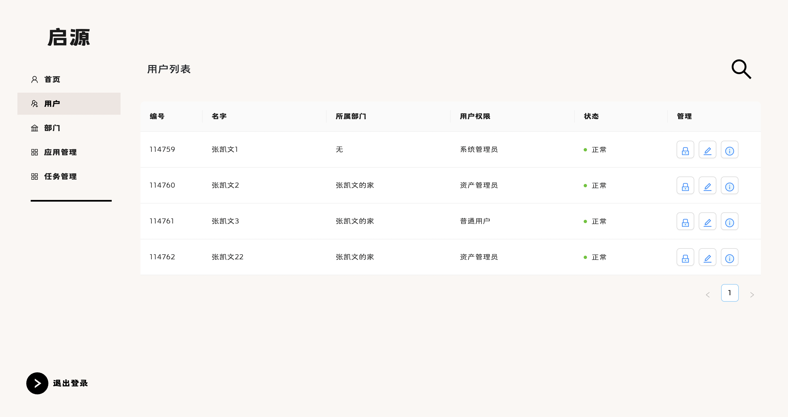

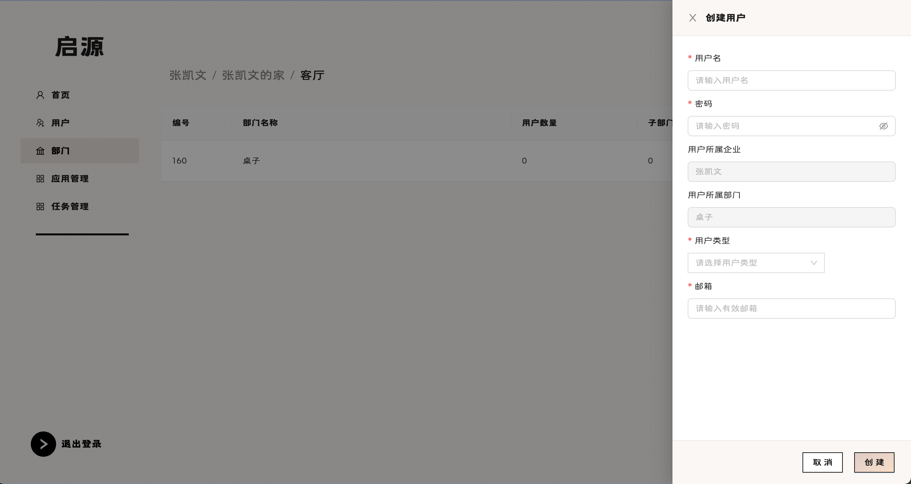

### FT:04 组织数据管理
**需求要求**: 系统管理员查看和维护企业的组织部门数据。组织可以是多级。组织用于员工的归属和资产的挂账部门。
 

**测试方法**：以系统管理员的身份进入系统，进入部门页面后可以点击当前层级的部门下的子部门进入。进入后可以通过右上角的添加按钮在当前的层级创建新的部门。进入子部门后还可以通过点击表格上部门路径中的名称跳转到对应的部门

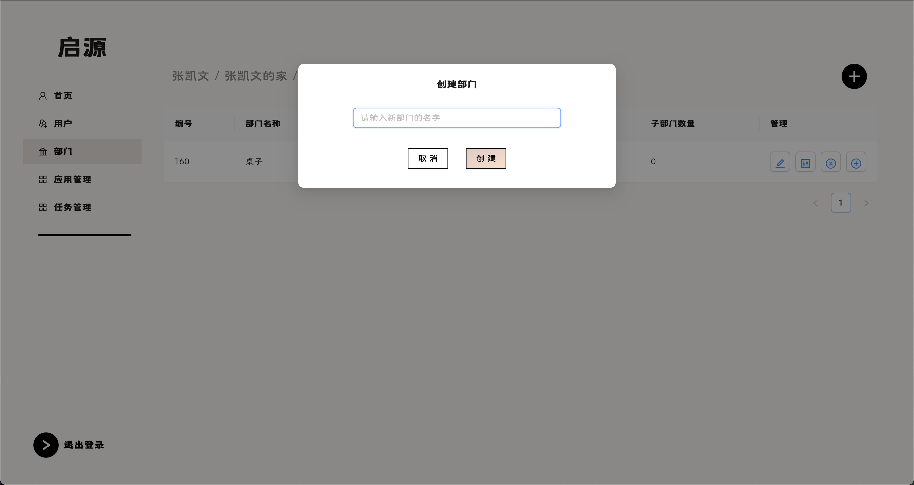

### FT:05 员工数据管理
**需求要求**: 系统管理员查看和维护企业的员工数据。员工用于资产的挂账人。
 

**测试方法**：以系统管理员身份进入系统后，可以在用户页面通过搜索功能定位到整个部门下的用户，也可以通过搜索编号和其他用户信息精准的定位到需要维护的用户，从而对他的数据进行操作。

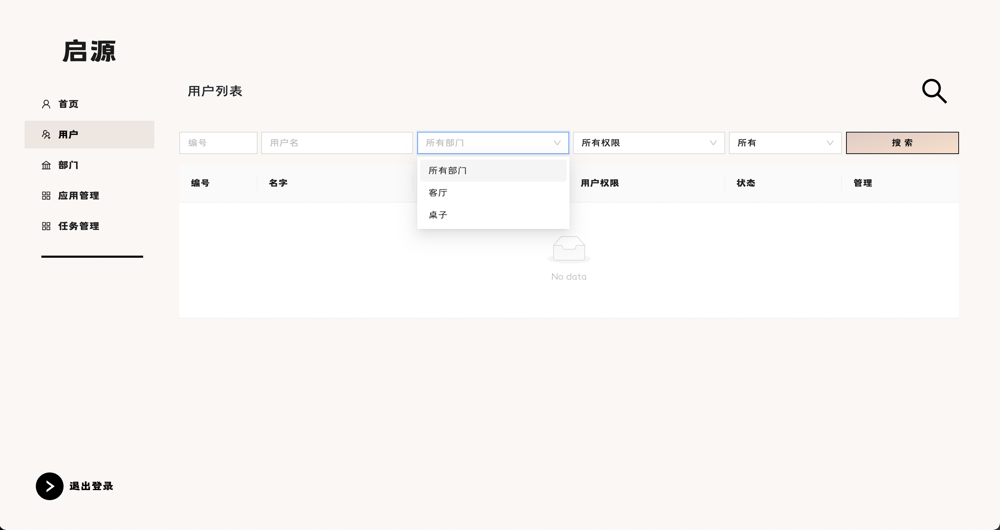

### FT:06 应用门户
**需求要求**: 员工登录系统后，显示不同应用的门户入口。例如显示资产管理入口，进入后界面菜单为资产管理应用的菜单。
 

**测试方法**：通过不同权限等级的用户登录的系统会有不同的边栏和主页内容。

超级管理员：
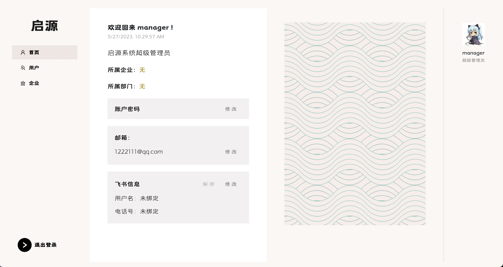

系统管理员：
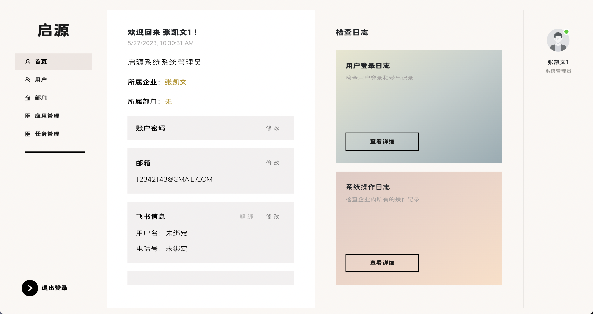

资产管理员：
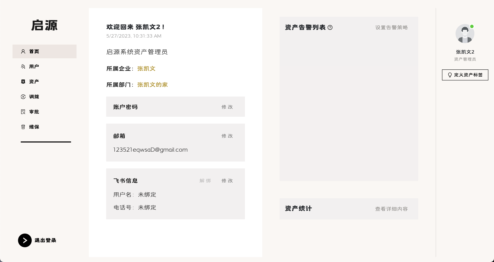

普通用户：
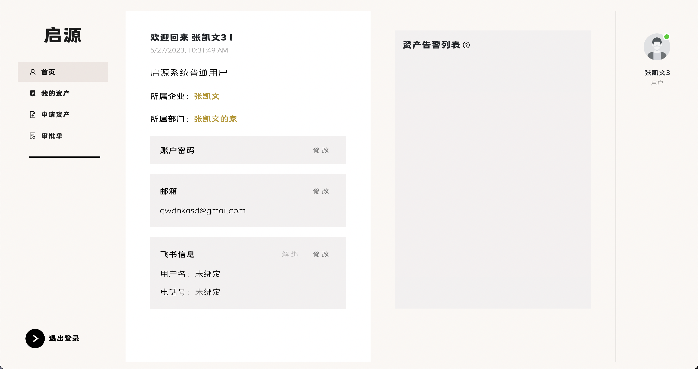

### FT:07 应用管理
**需求要求**: 系统管理员可以管理应用。应支持将第三方 URL 配置为一个菜单项。不同菜单项对应不同的功能权限。
 

**测试方法**：以系统管理员身份进入系统后，可以在应用管理页面对不同权限等级的用户应用进行编写，需要注意为了防止边栏的过度拥挤，不同的用户可以设置的应用数量最多只能有5个。

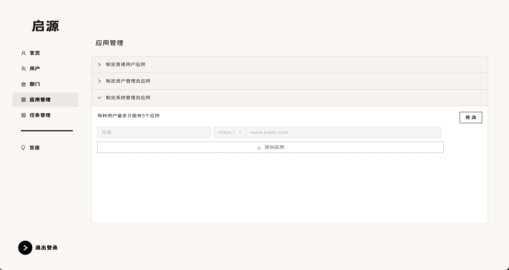

### FT:08 待办任务
**需求要求**: 员工需要处理的代办任务的入口，主要是审批单。例如主管所收到的资产领用的审批单。
 

**测试方法**：以资产管理员身份进入系统后，可以在审批页面查看当前用户需要处理的审批内容。当普通用户向资产管理员申请使用资产，资产管理员便有权限同意或者拒绝用户的申请。审批页面同时也会显示审批历史，方便资产管理员对于资产走向进行定位。

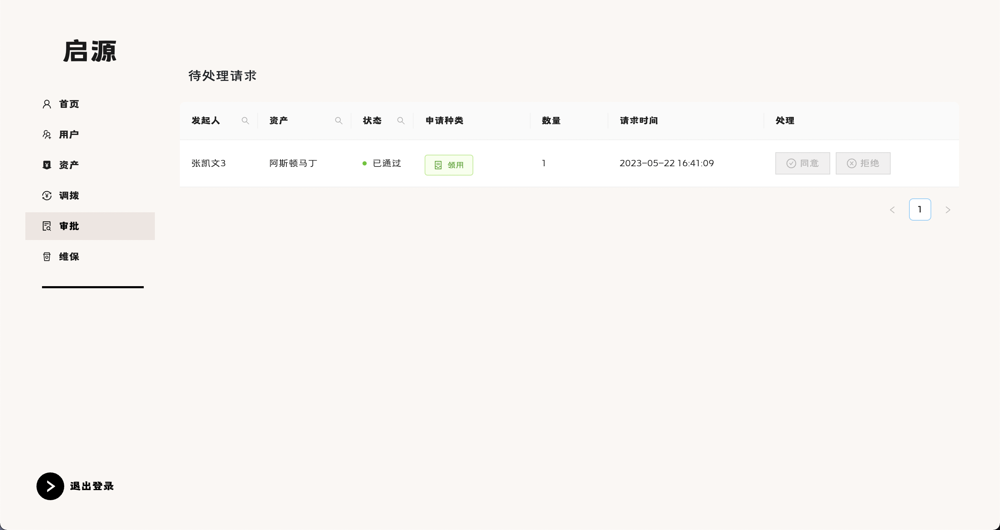

### FT:09 操作日志
**需求要求**: 系统管理员可以查看系统操作日志，包括登录日志、关键数据修改日志。
 

**测试方法**：以系统管理员身份进入系统后，可以在主页进入日志查看，两个日志分别为登录日志，记录了企业下所有用户的登录和登出记录，以及操作日志，记录了企业下所有的修改，创建，和删除操作。同时考虑到日志的数量会非常庞大，两个页面都添加了搜索功能，系统管理员可以通过搜索日期，信息，对象，或者用户对日志进行搜索，从而定位到需要查看的信息。

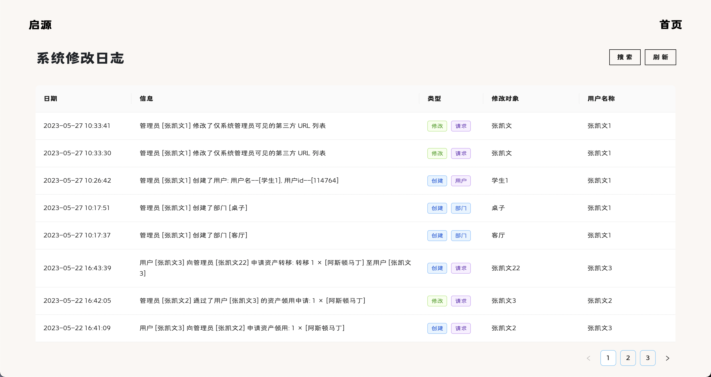

### FT:10 导入导出管理
**需求要求**: 批量导入或导出时需要创建异步任务。系统管理员可以查看和管理异步任务，包括下载失败记录文件，重新执行任务，下载任务结果文件等。
 

**测试方法**：以资产管理员身份进入系统后，可以在任务管理页面查看到企业下资产管理员的导入导出记录，同时如果资产管理员的导入任务没有全部成功导入，便可以将未成功的任务进行下载修改，然后再次上传进行重新执行。

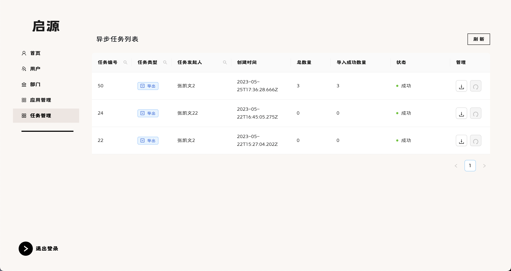

### FT:11 飞书账号绑定
**需求要求**: 系统已有用户支持绑定飞书账号，并支持通过飞书的方式登录。
 

**测试方法**：用户登录后可以通过首页的**飞书信息**中的**修改**按钮进行系统用户绑定飞书账号的操作，如果提示绑定成功后，就可以在登陆界面通过**飞书登录**按钮通过飞书方式进行登录，而不需要输入密码。

### FT:12 飞书消息推送
**需求要求**: 将站内的消息提醒自动推送到账号所绑定的飞书账户中，包括员工的申请成功提交提醒、申请状态修改提醒，资产管理员的新申请提醒等等。(网页端的审批情况推送到飞书，包括新审批，审批结果通知)
 

**测试方法**：用户在绑定飞书账户后，每次登录登出或者执行某些关键操作(如审批等)，飞书账号都会收到一条消息推送。形式如下图。

### FT:13 飞书审批管理
**需求要求**: 资产管理员可以利用飞书的审批功能来审批资产相关的申请而无需进入网页端操作。调用飞书审批 API，使用飞书审批系统进行资产审批
 

**测试方法**：如果用户在系统中的角色为资产管理员，并且绑定了飞书账号，那么当同部门的一级用户（必须也绑定飞书）账号向他发送资产审批请求时，他的飞书账号会收到一条待审批的消息卡片，此时他可以在飞书客户端点击“同意”或者“拒绝”直接完成审批，无需进入网页端操作。

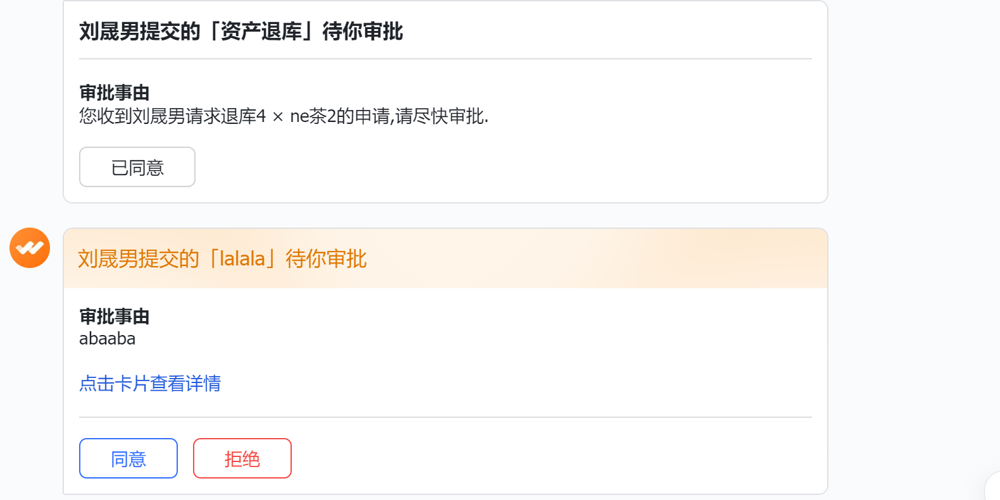

### FT:14 飞书人事管理
**需求要求**: 支持向系统同步飞书中的所有用户并在系统中自动创建。支持自动同步飞书新增员工
 

**测试方法**：如果用户在系统中的角色为资产管理员，并且绑定了飞书账号，那么在他的**用户**界面上方会出现一个**同步飞书用户**的按钮，点击即可将飞书企业下未加入该系统的用户同步到本系统中（注意未加入的定义是该飞书用户还没有绑定系统中的用户）。

如果飞书企业中有员工入职，系统会自动创建员工，如果用户在系统中的角色为资产管理员，并且绑定了飞书账号，那么在员工入职后，他可以立刻在**用户**界面找到新入职的员工。

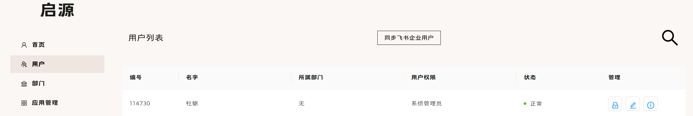

### FT:15 业务实体定义
**需求要求**: 系统的超级管理员创建和管理该应用的业务实体列表。业务实体表示共用同一个系统但互相隔离的不同组织如租户。业务实体可以是一个顶级部门，或一个子公司。业务实体之间的资产是隔离的，不能互相使用。系统的超级管理员可以为每个业务实体委派系统管理员。
 

**测试方法**：以超级管理员身份进入系统后可以进入企业页面查看和修改企业的信息。超级管理员在企业管理页面添加新的企业后，需要进入用户页面为新的企业创建系统管理员。不同企业的名称不能相同，但不同企业下的部门名称可以相同。

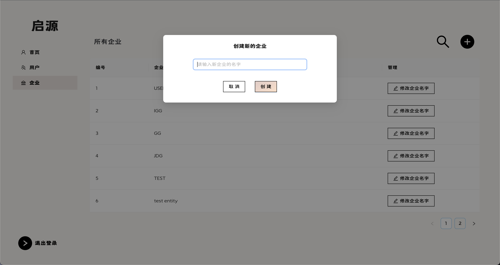

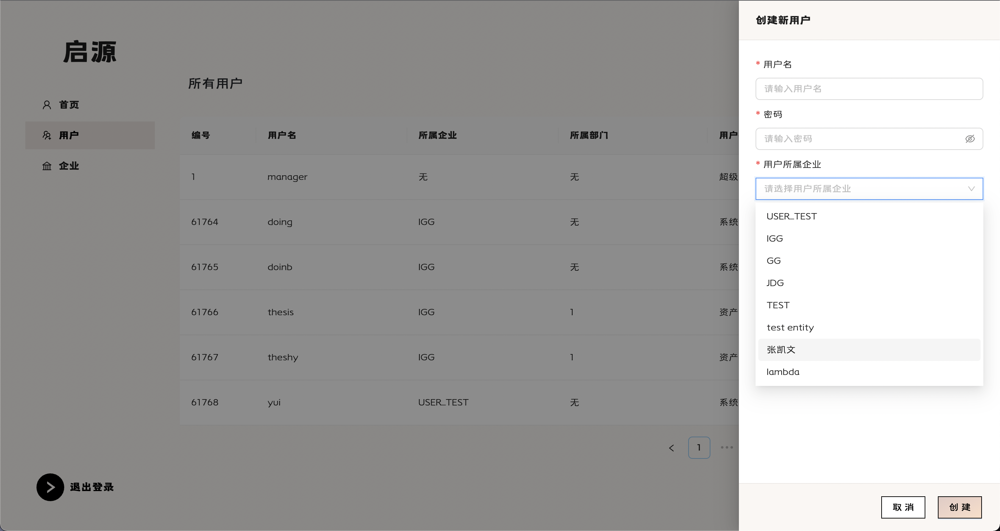

### FT:16 资产分类定义
**需求要求**: 资产管理员定义资产的层级分类树。具体的资产将必须挂靠在某个层级分类下。该层级分类为资产的自然分类，即品类。支持每种品类定义是条目型资产还是数量型资产。
 

**测试方法**：以资产管理员身份进入系统后，可以在资产页面中的选择栏中选择查看的资产分类，同时也可以在当前分类下创建或者删除新的分类。需要注意的是如果分类下有资产存在就无法对其进行删除操作。

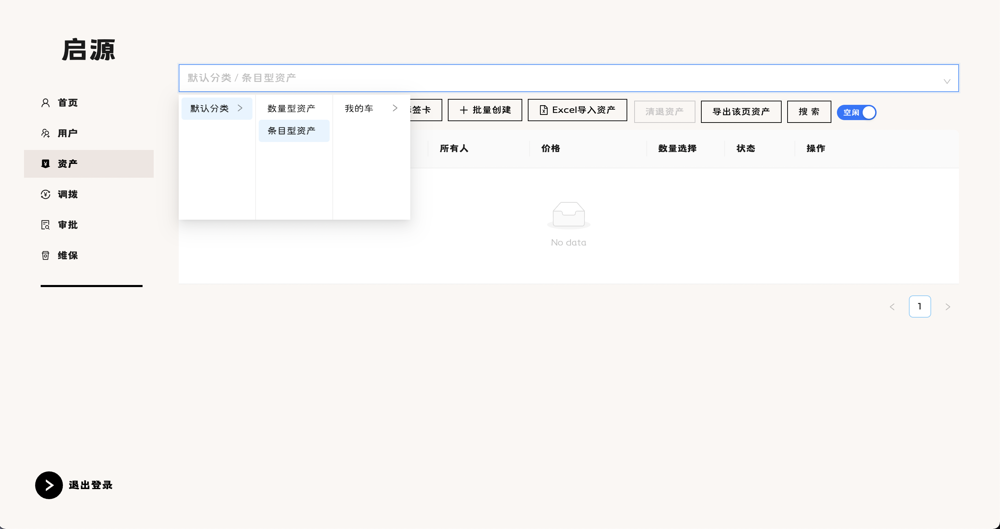

### FT:18 资产标签定义
**需求要求**: 资产管理员定义打印出来的资产标签卡片内容的模板。打印出来的资产标签用于粘贴在资产设备上。
 

**测试方法**：以资产管理员身份进入系统后，在主页的用户头像下，可以点击定义资产标签卡片，定义的标签卡片支持在资产页面中打印空的模版方便用户自行填写，同时也支持打印单个资产已经填写好的资产标签。

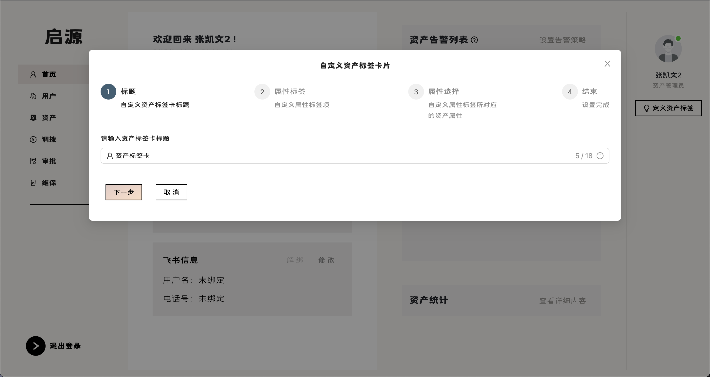

### FT:19 资产录入
**需求要求**: 资产管理员可以一次录入多个资产，包括条目型资产和数量型资产。多个资产之间存在主从关系，例如计算机主机和显示器、耳机。新录入的资产先挂账在某个资产管理员下。资产录入的有关信息支持富文本格式编辑。
 

**测试方法**：以资产管理员身份进入系统后，可以在资产页面批量创建新的资产，创建资产的过程中可以选择将一个资产设置为另一个条目型资产的附属资产。在创建资产后，可以在资产信息页面中编辑单个资产的富文本信息以及图片描述。

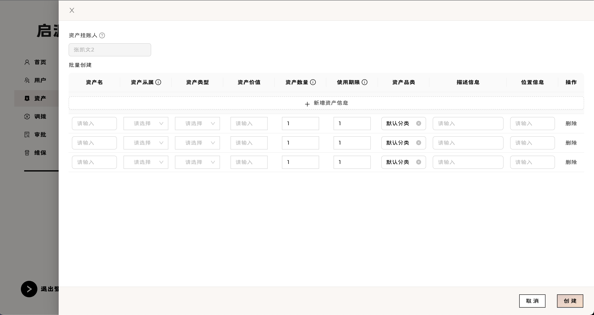

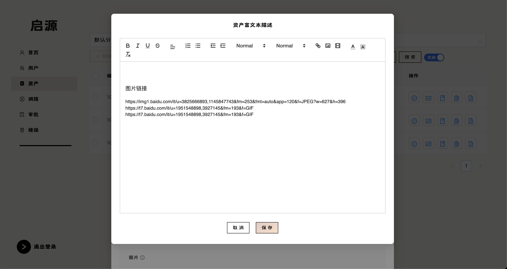

### FT:20 资产信息变更
**需求要求**: 资产管理员可以修改单个资产实例的信息，包括基本资料、位置、价值、数量等。资产管理员可以变更资产之间的主从关系。例如将某计算机的显示器配件关联到另一台计算机。
 

**测试方法**：以资产管理员身份进入系统后，可以在资产页面查看并且修改资产的信息。

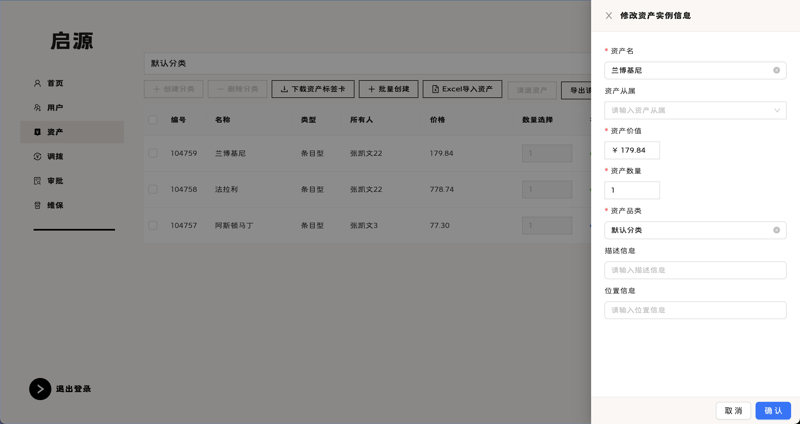

### FT:21 资产查询 / FT:25 资产历史
**需求要求**: 资产管理员根据常用条件如名称、描述、分类等查询自己管辖的资产。资产管理员可以查看单个资产的全视图，包括资产资料、使用情况、维保历史、转移历史、借用历史等。资产管理员可以打印单个资产实例的标签，用于粘贴在资产设备上。资产管理员或专员根据常用条件查询资产的变更历史，包括维保、转移、借用等。
 

**测试方法**：以资产管理员身份进入系统后，可以在资产页面查看资产的不同历史。同时也支持用户查看单个资产的信息，以及打印定义后的资产标签。

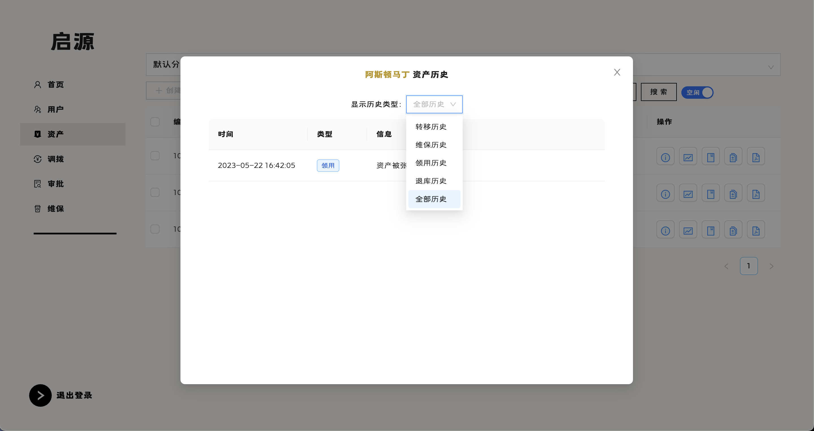

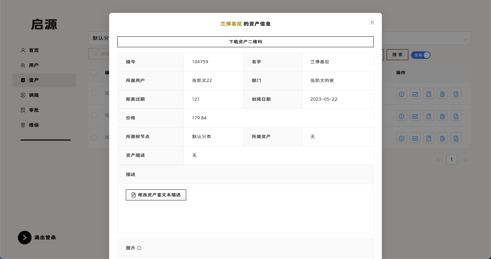

### FT:22 资产批量导入
**需求要求**: 资产管理员可以通过文件批量导入资产。场景一:部门新采购了一批 资产，需要快速导入到资产管理应用系统;场景二:以前手工 EXCEL 管理的资产，需要导入到新的资产管理应用系统。
 

**测试方法**：以资产管理员身份进入系统后，可以在录入资产时选择通过 EXCEL 批量导入资产。导入时可以选择先将资产模版下载，并将资产信息录入，再上传至网站。注意批量导入的资产需要严格符合给定的模版信息，否则会导入失败。

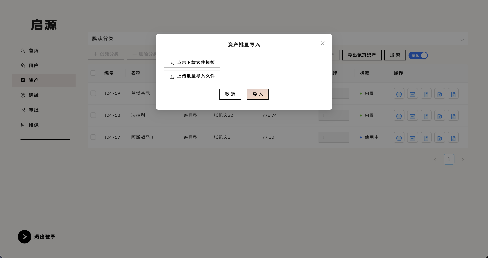

### FT:23 资产清退
**需求要求**: 资产管理员对已经服役期满或损坏报废的资产进行清退处理。一次可以清退多个资产。清退的资产价值为零，不能再参与使用。
 

**测试方法**：以资产管理员身份进入系统后，可以在资产页面对选择的资产进行清退操作，清退后的资产便不可以在进行转移修改等操作，但依然会保留在数据中。如果管理员需要进行查看，便可以通过资产页面右上角的蓝色 `switch` 切换查看已清退的资产。

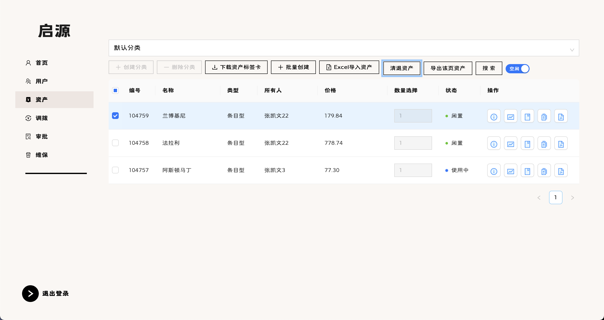

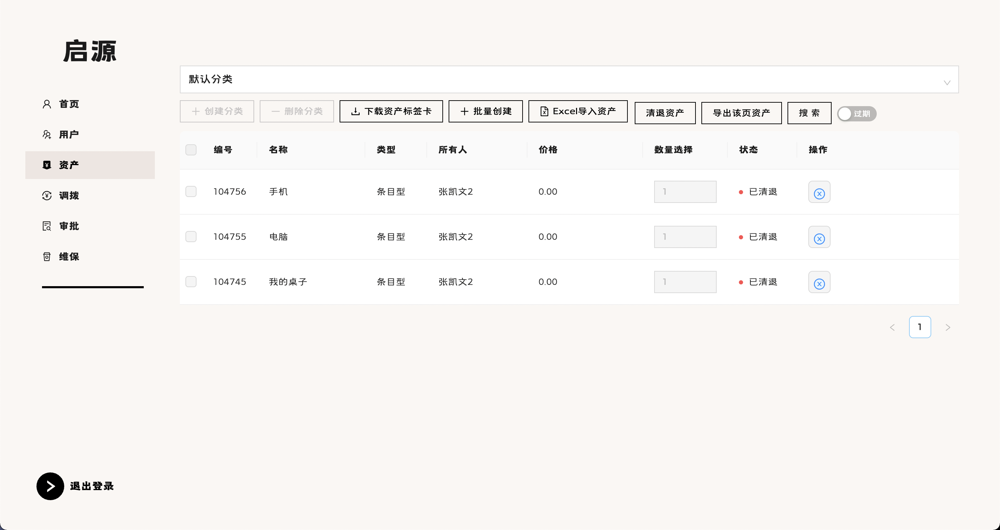

### FT:24 资产调拨
**需求要求**: 资产管理员向其他部门的资产管理员批量调拨资产。
 

**测试方法**：以资产管理员身份进入系统后，可以在调拨页面对自己名下的资产进行调拨，调拨时需要先选择调拨至的部门，然后选择部门内的资产管理员。调拨的资产可以是单个，也可以为多选。

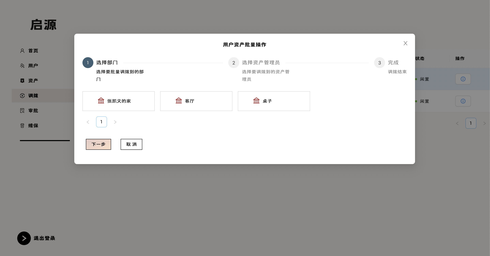

### FT:26 资产查看
**需求要求**: 员工查看自己名下挂账了哪些资产。对于资产的描述图片启用晚 加载机制。
 

**测试方法**：通过普通用户登录系统后，可以通过资产页面查看资产信息，在查看图片时，系统会采用晚加载机制，保证有大量图片时不会将所有图片同时加载。

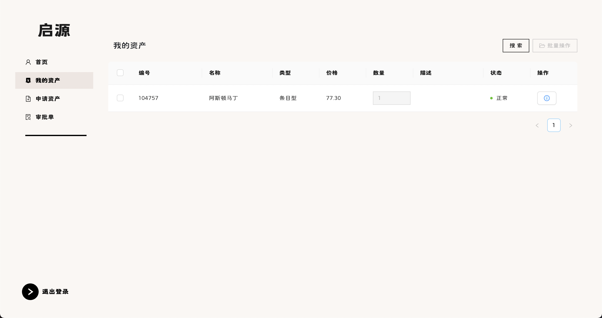

### FT:27 资产领用
**需求要求**: 员工向资产管理员领用资产。一次可以领用多个资产。员工先提交领用申请，经过资产管理员审批后，资产会挂账到当前员工名下。
 

**测试方法**：通过普通用户登录系统后，可以通过申请资产页面向不同资产管理员进行申请，在选择需要申请的资产后，点击申请会将申请发送到相对应的资产管理员等待审批。需要注意如果再次申请已经发送申请的资产，会显示报错。

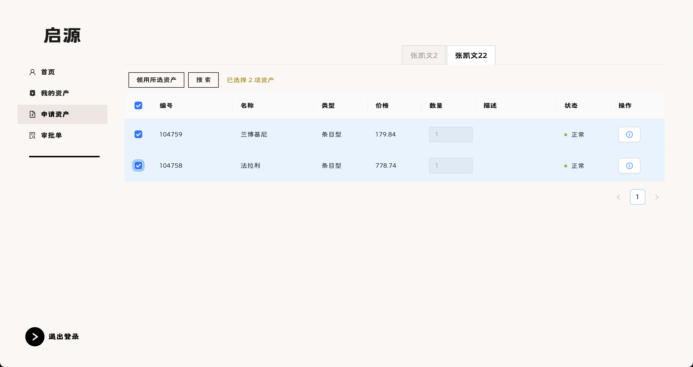

### FT:28 资产退库 / FT:29 资产维保 / FT:30 资产转移
**需求要求**: 员工的资产不再使用时，可以提交资产退库申请。当前部门的资产管理员收到申请后进行确认处理，资产就移交回资产管理员名下，待再次被领用。员工提交资产维修保养申请，维保责任人接到申请后将资产拿去维护处理。完成维护之后再交回给当前使用人。员工将某些资产转移给另一个员工。资产转移提交申请后，经过主管审批通过后，资产的挂账人和部门切换为新的员工和部门。资产的位置也跟着迁移到新位置。
 

**测试方法**：通过普通用户登录系统后，可以对自己的资产进行：退库，维保，转移三种不同的操作。在操作前，需要先选择处理操作的资产管理员。在资产管理员同意操作后，资产便会成功转移。如果选择的是维保，资产管理员便可以在维保结束后修改资产的价格以及新的到期日期，然后返还给用户。

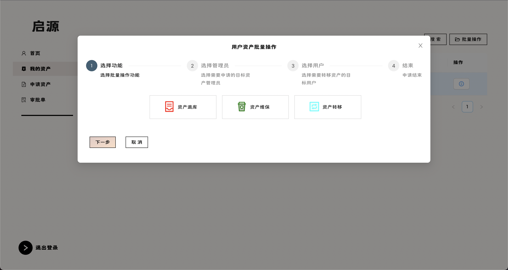

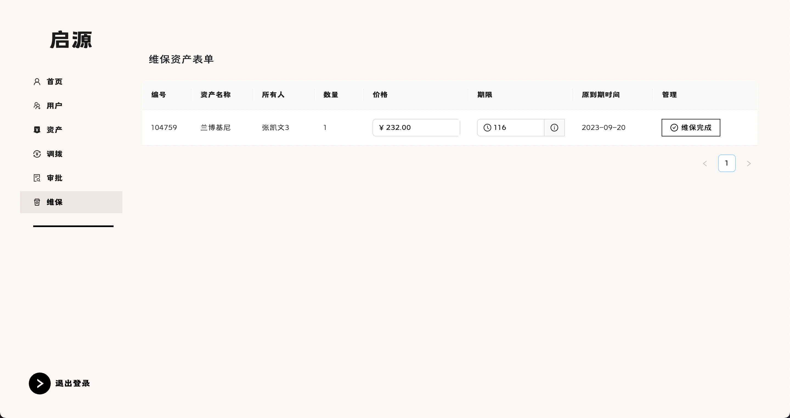

### FT:31 资产扫描
**需求要求**: 可以支持扫描粘贴在资产设备上的标签读取资产的有关信息。如果是 跳转式，请自行设计具有移动端适配功能的展示网页。如果完成了 OA 对接相关功能，可以实现为读取资产 ID 后自动唤起飞书，在飞书 中显示有关资产信息。
 

**测试方法**：通过资产管理员登录系统后，可以在查看资产的页面查看资产的信息，同时也可以下载对应资产的二维码，点击下载二维码后，便可以通过手机扫描二维码呈现出资产的信息。

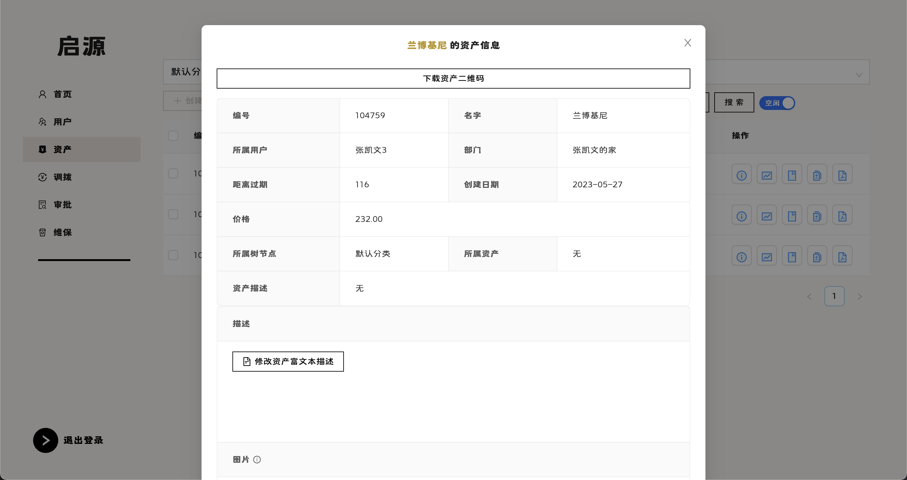

### FT:32 资产统计
**需求要求**: 资产管理员可以查看自己管辖内的资产的统计情况。包括:有多少资产;不同状态的资产分布;不同部门的资产分布;资产净值的变化曲线。
 

**测试方法**：通过资产管理员登录系统后，可以在用户主页点击查看当前部门的资产统计。进入统计页面后，管理员可以选择查看条目型，数量型，或者全部类型的资产价格以及资产数量变动。同时也可以分别看到条目型资产和数量型资产在当前部门下的状态分布。

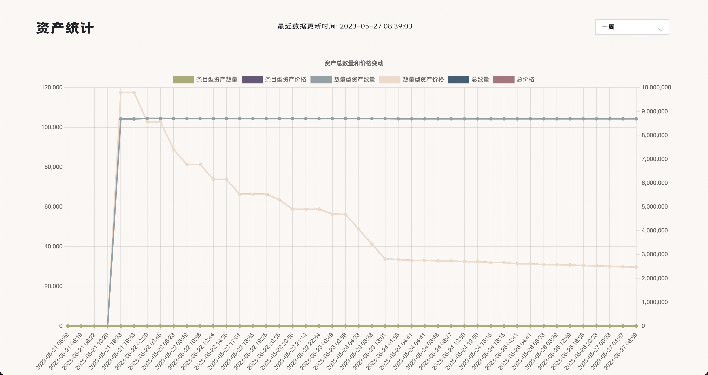
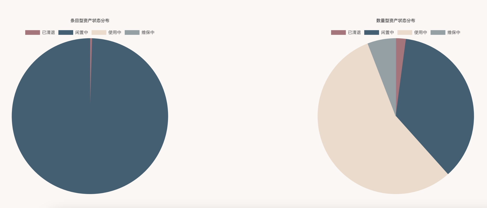

### FT:33 资产折旧
**需求要求**: 系统自动根据资产使用年限，根据年限平均模式，对所有资产进行折 旧运算，更新净值。例如:一台计算机原值 10000 元，使用年限为 5 年，则每年折旧 2000 元，5 年后净值为 0。净值为 0 后，则可以自动 做资产清退。
 

**测试方法**：通过资产管理员登录系统后，可以在资产页面中查看资产的价格变化曲线。通过显示的价格曲线变动可以看出资产会自动进行线性折旧。

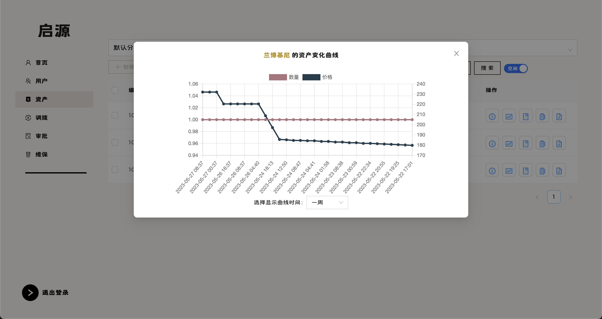

### FT:34 资产告警
**需求要求**: 资产管理员可以设置本部门内某些资源的告警策略，在现有资产示例满足某些条件(如资产过旧、资产因清退导致总量不足)时自动告警。
 

**测试方法**：通过资产管理员登录系统后，可以先从首页的告警信息列表中看到当前告警的资产，如果管理员希望添加或者编辑当前指定的告警策略，便可以点击设置告警策略按钮进入页面。在修改告警策略时，系统会提示剩余的资产数量，方便用户进行策略制定。

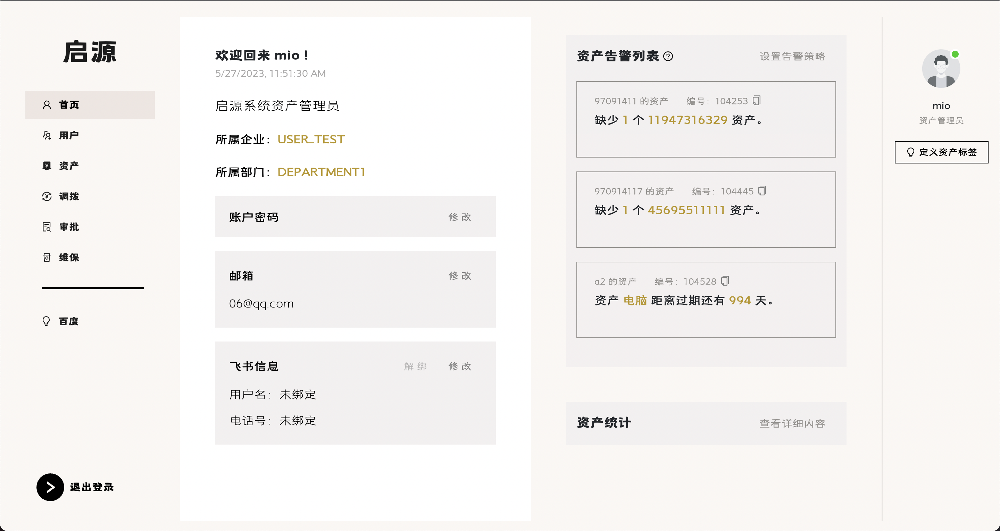

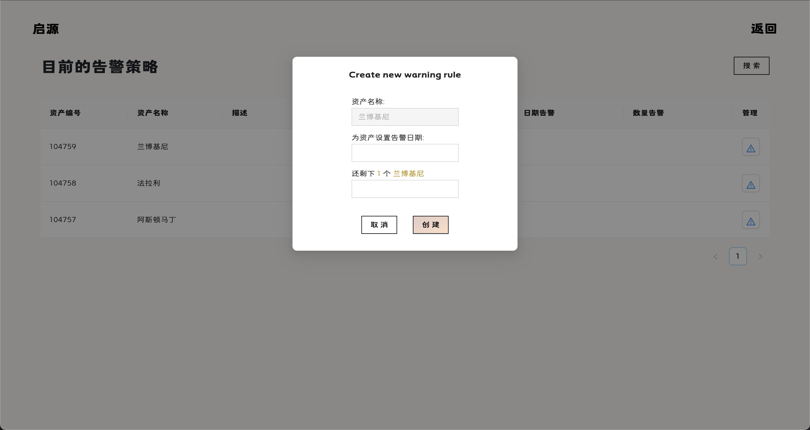

## 二， 拓展功能点
**用户复制编号进行查询**
在资产管理员查看资产告警时，为了方便管理员对已经告警的资产进行操作，系统支持用户一键复制资产的编号。获取资产编号后，资产管理员便可以进入资产搜索页面通过编号精准定位到相对应的资产，并且对其进行操作。

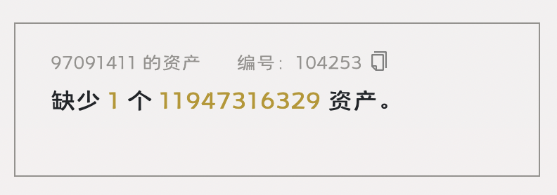

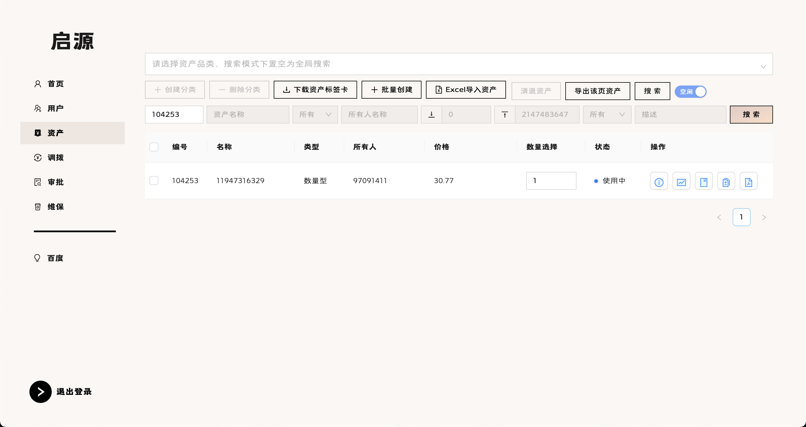

**用户修改个人信息**
考虑到用户可能需要对自身的信息进行修改，所有的用户都添加的修改自己本身密码和飞书帐号的功能，同时绑定了飞书账户后也可以进行解绑。

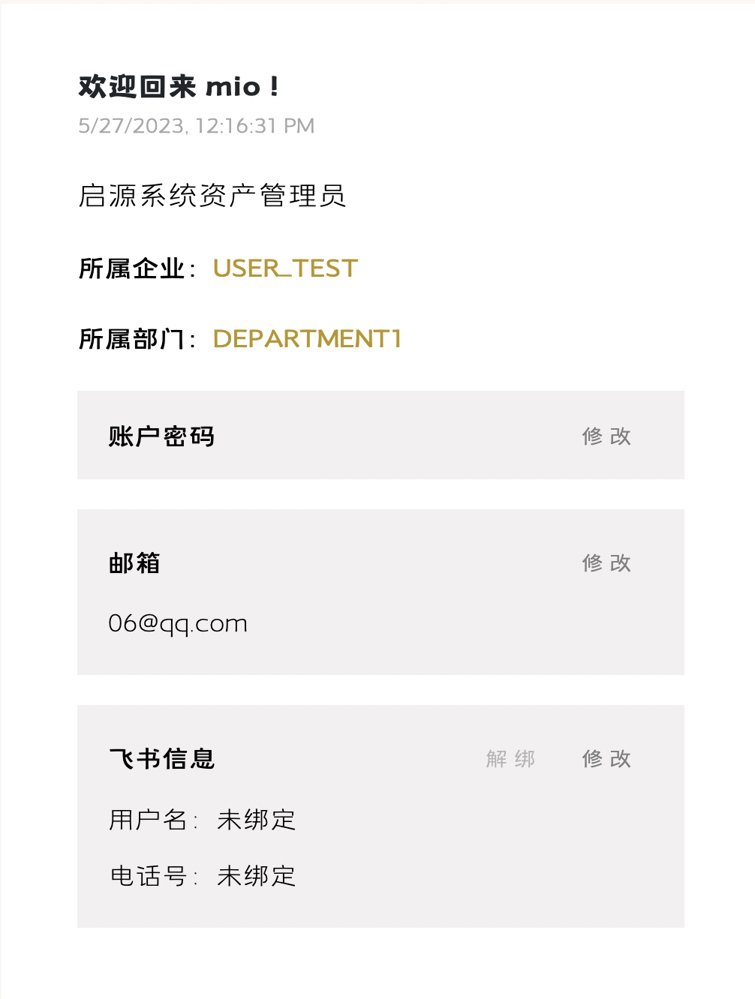

**网站整体UI样式一致**
网站的 UI 设计通过字体和按钮样式确保了整体样式和格式的统一，从视觉上不会让两个组件冲突，确保了用户的整体使用体验。
