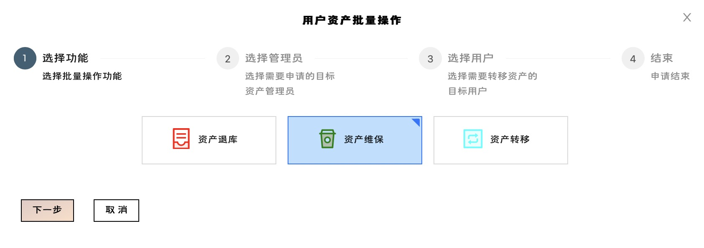
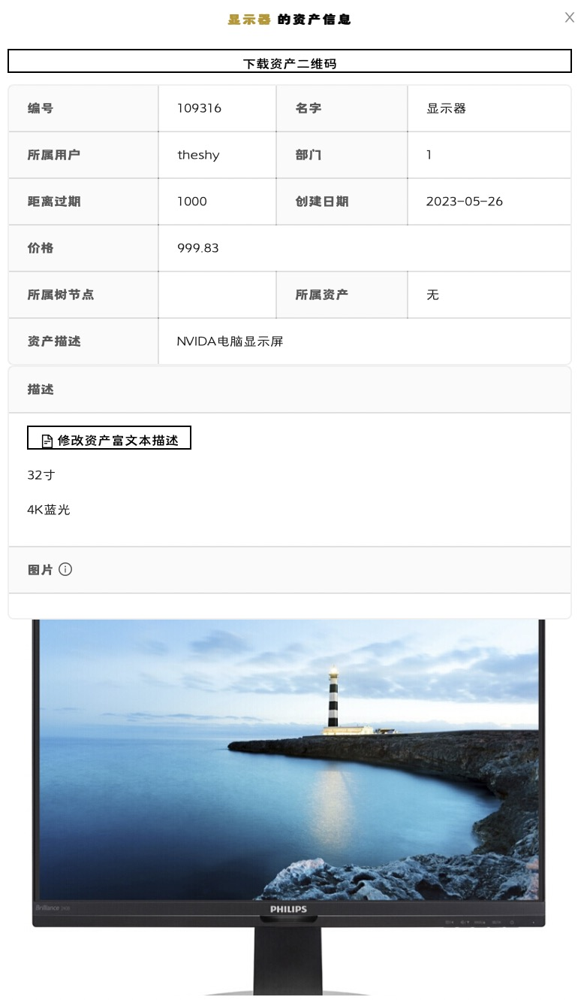
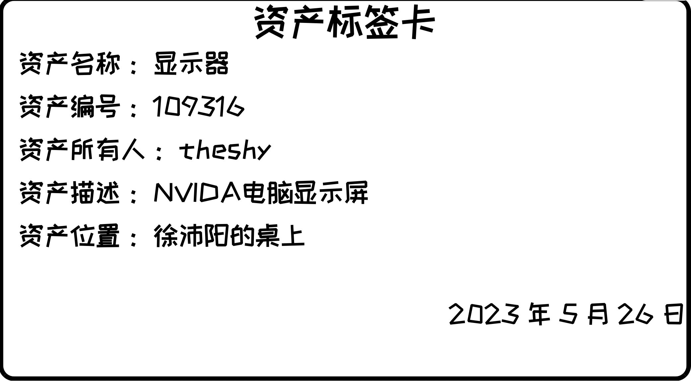
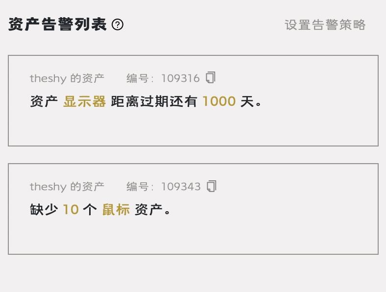
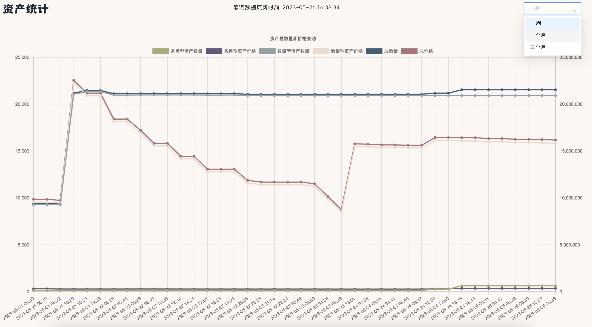
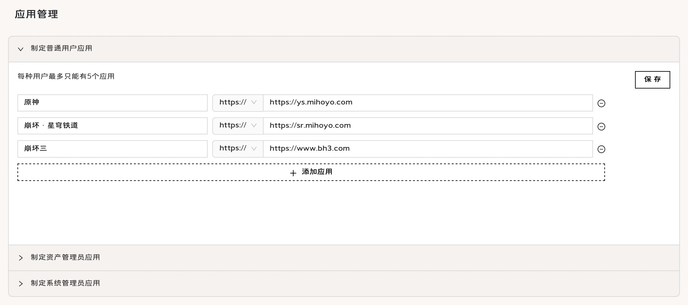
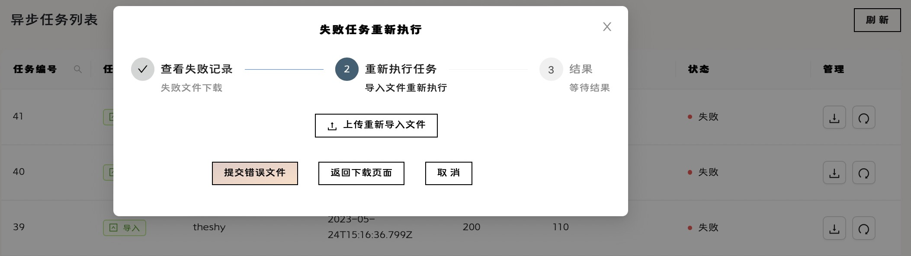

## 用户使用指南

感谢您使用**启源**资产管理系统！

本平台地址：[启源|资产管理系统](https://okok-am-frontend-okok.app.secoder.net)

### 登录

用户不需要也不必进行注册，进入企业时自动由所属企业的系统管理员完成账户创建，并将账户告知用户，用户用初始密码登录后可以修改密码，但不能修改用户名，类似清华账户的效果。此外，绑定邮箱功能并没有实质用途，用户可自行设置。

用户也能通过飞书登录系统，如果企业绑定了飞书，使用飞书登录后用户能够在数据库中自动创建；普通用户也能够绑定飞书账号，便于使用飞书登录。

    

    锁定与解锁
    
超级管理员以及系统管理员能够锁定与解锁用户，锁定后用户无法登录，且如果已经登录则无法进行任何操作，用户头像会有红点提示，代表用户已被锁定，正常情况下为绿点。

### 资产管理

资产管理是资产管理系统至关重要的一环。

#### 资产创建获取

##### 资产入库

只有资产管理员可以创建库中没有的资产，在**资产**界面点击相应按钮，支持通过手动录入进行创建，以及通过符合 Excel 模板的文件进行批量导入，**仅在 Excel 导入时**创建异步任务执行，如需查看异步任务执行情况，请联系企业系统管理员。

##### 资产领用

所有未被锁定的用户均可以在**领用资产**界面查看该部门资产管理员名下的闲置资产，通过选择进行批量领用。领用需要经过资产管理员逐条审批，审批通过后资产即到达用户名下，进入使用中状态。

#### 资产批量操作

##### 资产退库

如果资产不需要使用，可以在**我的资产**页面选定自己使用中的资产，通过点击**批量操作按钮**选择退库功能，并选定目标资产管理员发起审批，审批通过后资产返回管理员名下，进入闲置状态。

##### 资产维保

如果资产发生损坏，可以联系资产管理员进行维保，通过点击批量操作选择维保功能，并选定目标资产管理员发起审批，审批通过后资产返回管理员名下，进入维保状态。

##### 资产转移

如果资产需要进行转移，可以通过点击批量操作功能，选定目标资产管理员及目标用户发起审批，审批通过后资产转移至新的部门及用户名下，再次进入使用中状态。

##### 资产清退

仅有资产管理员能够进行资产清退操作，清退后的资产价值清零，无法再次进行任何操作，用户无法查看也无法选择自己已经清退的资产。如果用户有资产需要进行报废处理，请先执行退库操作，由资产管理员进行清退。

#### 资产个性化管理

##### 资产信息

资产管理员以及用户均能够在**资产操作栏**中点击相应按钮查看资产详细信息，其中资产管理员能够支持下载资产信息二维码，能够通过移动端设备扫描后查看资产详细信息。资产管理员同样能够通过查看资产信息页面进行资产**富文本编辑**，并在富文本中添加**图片链接**进行定义，以便进行多角度多方位信息标识。

资产管理员同样能够在**主页头像下方**设计资产标签卡片用于打印，标签卡的标题，每一个子标题都支持自行定义，造就个性化的资产管理方式，在相应资产的**资产操作栏**即可获取标签卡片的 PDF 文件。注意资产标签卡片的定义不能也不必持久化存储，在退出后再次登陆需要重新定义，当然我们也提供了默认的资产标签卡片以供使用。

##### 资产告警

资产管理员能够在**主页**设置个性化的告警策略，针对部门内资产的数量或到期时间进行告警，设置策略后，用户能够在主页一栏中查看自己进入告警状态的资产，以便指导进行个性化资产操作；资产管理员能够查看部门内的资产告警名单，协助进行管理协调。

##### 资产统计

资产管理员能够通过**主页资产统计入口**查看本部门资产的价值变化曲线及各状态资产数量分布饼图，有助于全方位多层次了解部门资产状况，有助于为资产管理提出合理化指导性建议。

### 人事管理

资产管理系统基于企业，需要必要的企业人事管理。

#### 用户管理

企业系统管理员不属于任何部门，负责创建部门以及部门中的用户。用户创建只能在**部门操作栏**中进行，同时支持改名，转移部门，删除操作。部门的删除和转移仅对没有用户的部门生效。

在部门列表界面，通过**点击某一个部门栏**能够查看其子部门，通过点击列表上方**面包屑导航栏中**某一级即可返回该层级，操作简便直观。

#### 应用配置

企业各级用户在使用本资产管理系统之余也需要其他第三方 URL 并行使用，方便用户跳转至其他平台进行相应操作。系统管理员能够在**应用管理**界面配置企业之间不互通，不同等级用户个性化的 URL，提高企业管理效率。

系统规定每个层级用户最多配置**五个**应用，请管理员规划使用频率最高的应用，以免应用过多影响用户体验。

#### 任务管理

部门内的资产管理员进行批量导入导出时有时会创建异步任务，系统管理员能够在**任务管理**界面查看本企业的异步任务列表，并支持任务结果信息的查看以及失败信息重新执行操作。

### 飞书绑定

TODO

